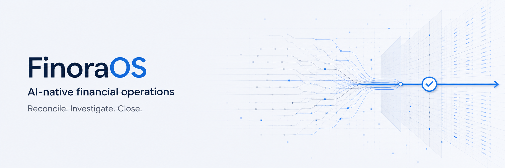

<p align="center">
  
</p>

<p align="center">
  <strong>AI-native financial operations for finance teams that need to reconcile, investigate, and close with evidence.</strong>
</p>

<p align="center">
  <a href="#quick-start">Quick start</a> ·
  <a href="#the-finoraos-loop">How it works</a> ·
  <a href="#demo-workflow">Demo workflow</a> ·
  <a href="#evaluation">Evaluation</a> ·
  <a href="https://github.com/IamPritamAcharya/FinoraOS">GitHub</a> ·
  <a href="docs/STATUS.md">Project status</a>
</p>

> **Buildathon prototype** · Built for the Razorpay AI Buildathon 2026, Track 04 — AI Finance Controller.

FinoraOS is not a chatbot over a database. It is a financial operations workspace where deterministic software handles verifiable finance work and AI is reserved for ambiguity, investigation, and explanation.

The flagship V1 workflow is reconciliation and exception closure: process a batch of financial records, match what can be proven, surface honest exceptions, then give a finance user evidence for the next controlled action.

## Why FinoraOS

Finance teams lose time reconciling payment, settlement, bank, invoice, and tax information across systems. The difficult work is rarely arithmetic—it is locating evidence, explaining variance, resolving ambiguity, and leaving an audit trail.

FinoraOS is designed around that reality:

- **Deterministic first** for IDs, references, amounts, settlement relationships, and date windows.
- **AI only for ambiguity**—never for arbitrary SQL, direct data writes, or financial calculations.
- **Evidence before action** with structured records, traceable source metadata, proposed actions, and audit events.
- **One shared source of truth** behind a finance workspace and the Finora conversational interface.

## The FinoraOS loop

```text
Organization-scoped financial records
                │
                ▼
   @finora/reconciliation (pure deterministic engine)
                │
        ┌───────┴────────┐
        ▼                ▼
     Matches         Exceptions
                         │
                         ▼
              Controlled investigator tools
                         │
                         ▼
                 Typed proposed resolution
                         │
                         ▼
          Validation → approval → audit → rerun
```

The reconciliation engine has no Prisma, NestJS, database, HTTP, environment, clock, vendor SDK, LLM, or random dependency. The API is responsible for organization-scoped loading and transactional persistence; the engine is responsible only for repeatable matching decisions.

## What is working in V1

| Capability                   | What it does now                                                                                                                                                    |
| ---------------------------- | ------------------------------------------------------------------------------------------------------------------------------------------------------------------- |
| Finance workspace            | Branded overview, Finora chat, records, reconciliation, and exceptions views over seeded backend data.                                                              |
| Deterministic reconciliation | Exact-reference, settlement-relationship, date-window, and explicit composite-score matching. Ambiguous cases are never forced into a match.                        |
| Exception persistence        | Reconciliation runs persist matches, exceptions, exception evidence, metrics, and audit events transactionally.                                                     |
| Settlement Q&A               | Ask Finora about `STL_0001`; amounts and variance are calculated deterministically, then a configured AI gateway may provide a constrained qualitative explanation. |
| Local AI                     | `MockAiGateway` for tests and `OllamaGateway` for local Qwen development.                                                                                           |
| Synthetic demo               | Reproducible Acme Commerce India data: 120 transactions, 12 settlements, invoices/tax lines, and seeded exceptions.                                                 |
| Evaluation harness           | Runs the same shared reconciliation package against checked-in input and ground truth.                                                                              |

### Honest V1 boundaries

- Banking and payment connections are traceable mock adapters; no real money movement is performed.
- Settlement chat can use Ollama through the API gateway. The exception investigator is still being wired from its mock provider to the configured gateway.
- Chat history is browser-local for the demo; server-side thread persistence is V1.x work.
- This is not a production payment system, tax-compliance product, or claim of regulatory certification.

## Demo workflow

1. Open **Finora** at `http://localhost:3000`.
2. Ask: `Why was settlement STL_0001 short?`
3. See the deterministic settlement breakdown: expected amount, received amount, gateway fee, GST, refund, and the explained variance.
4. Open **Reconciliation** to inspect the latest measured run.
5. Open **Exceptions** to inspect the queue and its supporting reasons.
6. Run the evaluation harness to demonstrate batch-level accuracy—not a cherry-picked result.

The app supports normal route navigation. Chat threads restore from browser storage so a finance user can check another workspace view and continue the same conversation.

## Quick start

### Prerequisites

- Node.js **24 LTS** (the current development environment also accepts Node 26)
- pnpm **10.16+**
- Docker Engine with Docker Compose
- Optional: Ollama for local AI explanations

If pnpm is not available globally:

```bash
npm exec --package=pnpm@10.16.0 -- pnpm --version
npm exec --package=pnpm@10.16.0 -- pnpm install
```

### Run the complete local demo

```bash
git clone https://github.com/IamPritamAcharya/FinoraOS.git finora-os
cd finora-os
cp .env.example .env
pnpm install
pnpm db:generate
pnpm dev
```

`pnpm dev` starts PostgreSQL and Redis, applies committed migrations, refreshes the reproducible demo seed, then launches:

- Web: `http://localhost:3000`
- API: `http://localhost:3001/api`

Press `Ctrl+C` to stop the web/API processes and gracefully bring down the Docker services. To keep infrastructure alive after stopping development servers:

```bash
pnpm dev:keep-infra
```

For manual control instead:

```bash
pnpm infra:up
pnpm db:deploy
pnpm seed
pnpm dev:web
pnpm dev:api
```

## Local AI with Ollama

FinoraOS defaults to `mock`, so tests and CI never download or call a model. To use local Qwen for the settlement-chat explanation layer:

```bash
curl -fsSL https://ollama.com/install.sh | sh
ollama pull qwen3:4b-instruct-2507-q4_K_M
ollama run qwen3:4b-instruct-2507-q4_K_M "Reply with exactly: Finora ready"
```

Set these values in `.env` and restart `pnpm dev`:

```env
AI_PROVIDER=ollama
AI_MODEL=qwen3:4b-instruct-2507-q4_K_M
OLLAMA_BASE_URL=http://localhost:11434
```

Then ask Finora:

```text
Why was settlement STL_0001 short?
```

Finora calculates the amounts itself. The model can only contribute a concise, number-free qualitative explanation; it cannot generate SQL or mutate financial records.

## Evaluation

Run the exact deterministic engine used by the API against the checked-in synthetic dataset:

```bash
pnpm eval:reconciliation
```

Current expected baseline:

```text
FinoraOS Reconciliation Evaluation

Records processed             240
Correct matches                108
Incorrect matches                0
False auto-matches              0

Exceptions                      12
Unexpected exceptions            0
Unresolved count                12

Match accuracy               100.00%
```

These are measured results from the fixture and ground truth—not dashboard placeholders. Difficult cases remain visible as exceptions rather than being hidden to inflate the score.

## Architecture

```text
apps/web                 Next.js 16 workspace and Finora chat UI
apps/api                 NestJS API, finance/reconciliation modules and gateways
packages/platform        Shared enums, Zod schemas, money helpers, logger
packages/reconciliation  Pure deterministic matching engine
packages/agents          Controlled agent capabilities and typed tool contracts
packages/ui              Finora design tokens, primitives, finance presentation
prisma                   PostgreSQL schema, migrations and reproducible seed
datasets                 Checked-in synthetic inputs and expected ground truth
evals                    Batch-level accuracy and exception metrics
```

### Provider and safety boundaries

```text
Finance / reconciliation services → gateway contracts → external systems
Agent capability → controlled organization-scoped tools → AI gateway
LLM output → Zod validation → policy / approval → audit record
```

Business modules do not import vendor SDKs directly. Agents do not import Prisma. Raw imported records remain traceable, monetary values use PostgreSQL `Decimal(18,2)` plus `decimal.js`, and API boundaries use strings for money.

## Commands

| Command                             | Purpose                                                                           |
| ----------------------------------- | --------------------------------------------------------------------------------- |
| `pnpm dev`                          | Start infrastructure, migrate, seed, start web/API; shut down services on Ctrl+C. |
| `pnpm dev:keep-infra`               | Same as `dev`, but retains Docker services on exit.                               |
| `pnpm infra:up` / `pnpm infra:down` | Start or stop PostgreSQL and Redis.                                               |
| `pnpm db:generate`                  | Generate the Prisma client after a fresh install or schema change.                |
| `pnpm db:migrate`                   | Create and apply a development migration.                                         |
| `pnpm db:deploy`                    | Apply committed migrations.                                                       |
| `pnpm seed`                         | Refresh the deterministic Acme Commerce India demo data.                          |
| `pnpm check`                        | Format check, lint, typecheck, and tests.                                         |
| `pnpm check:enums`                  | Verify Prisma and shared platform enum values do not drift.                       |
| `pnpm eval:reconciliation`          | Run reconciliation evaluation against ground truth.                               |
| `pnpm build`                        | Build all workspace packages with low concurrency.                                |

## Repository conventions

- Read [AGENTS.md](AGENTS.md), [docs/STATUS.md](docs/STATUS.md), [docs/DECISIONS.md](docs/DECISIONS.md), and [docs/ROADMAP.md](docs/ROADMAP.md) before substantial changes.
- Reuse the FinoraOS shared tokens and components in `packages/ui`; preserve [the brand system](docs/BRANDING.md).
- Keep reconciliation logic deterministic and isolated in `@finora/reconciliation`.
- Never let an LLM issue arbitrary SQL, calculate authoritative monetary values, or mutate financial records directly.
- Use Conventional Commits. Hooks remain lightweight and never call Ollama.

## Documentation

- [Current project status and handoff](docs/STATUS.md)
- [Architecture decisions](docs/DECISIONS.md)
- [Product roadmap](docs/ROADMAP.md)
- [FinoraOS visual identity](docs/BRANDING.md)
- [Synthetic dataset notes](datasets/synthetic/README.md)

## License

This Buildathon prototype has no published license yet. Do not treat it as an official Razorpay product or production financial service.
