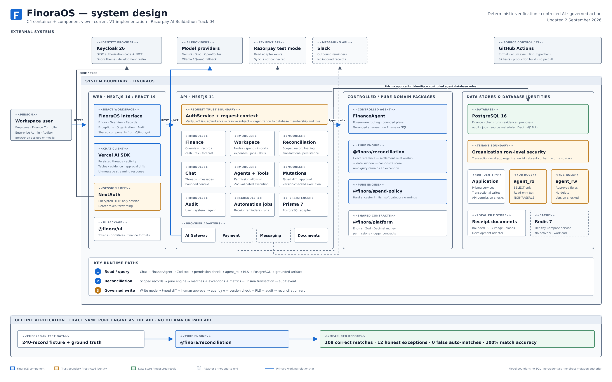

<p align="center">
  
</p>

<p align="center">
  <strong>An AI-native finance operations OS for records, people, policies, agents, approvals, and audit.</strong>
</p>

<p align="center">
  <a href="#quick-start">Quick start</a> ·
  <a href="#system-design">System design</a> ·
  <a href="#demo-workflow">Demo workflow</a> ·
  <a href="#evaluation">Evaluation</a> ·
  <a href="https://github.com/IamPritamAcharya/FinoraOS">GitHub</a> ·
  <a href="docs/STATUS.md">Project status</a>
</p>

> **Buildathon prototype** · Built for the Razorpay AI Buildathon 2026, Track 04 — AI Finance Controller.

FinoraOS is not a chatbot over a database. It is a multi-role finance operations control plane where employees submit evidence, finance teams operate shared records, administrators govern organizational spend, and controlled agents investigate and propose actions.

The flagship V1 workflow is reconciliation and exception closure: process a batch of financial records, match what can be proven, surface honest exceptions, investigate only the ambiguity, then validate, approve, audit, and rerun. The same platform also manages receipts, expense review, organization budgets, spend controls, notifications, jobs, custom agent skills, and governed record corrections.

## Why FinoraOS

Finance operations span more than one finance team or one screen. Employees hold missing receipt evidence. Controllers reconcile payments and settlements. Administrators define budgets and policies. Auditors need an immutable explanation of who or what changed each record. Today these loops are fragmented across spreadsheets, inboxes, provider dashboards, and manual follow-up.

FinoraOS is designed around that reality:

- **Deterministic first** for IDs, references, amounts, settlement relationships, and date windows.
- **AI only for ambiguity**—never for arbitrary SQL, direct data writes, or financial calculations.
- **Evidence before action** with structured records, traceable source metadata, proposed actions, and audit events.
- **One operating layer** across employee self-service, finance records, organization policy, automation, and Finora.
- **Role and tenant boundaries** enforced by Keycloak identity, database-owned membership, API permissions, and PostgreSQL row-level security.

## The FinoraOS loop

```text
Organization-scoped financial records
                │
                ▼
   @finora/reconciliation (pure deterministic engine)
                │
        ┌───────┴────────┐
        ▼                ▼
     Matches         Exceptions
                         │
                         ▼
             Scoped evidence + controlled tools
                         │
                         ▼
              AI-assisted typed proposal
                         │
                         ▼
               Zod + policy validation
                         │
                 ┌───────┴────────┐
                 ▼                ▼
          Human approval     Reject / escalate
                 │
                 ▼
        Derived adjustment + audit
                 │
                 ▼
       Deterministic rerun → closed or open
```

The reconciliation engine has no Prisma, NestJS, database, HTTP, environment, clock, vendor SDK, LLM, or random dependency. The API is responsible for organization-scoped loading and transactional persistence; the engine is responsible only for repeatable matching decisions.

## System design

<p align="center">
  <a href="docs/SYSTEM_DESIGN.md">
    
  </a>
</p>

The architecture separates user experience, business orchestration, deterministic domain logic, external gateways, and execution identities. Finora can plan only over role-filtered, Zod-validated tools. It never receives SQL or credentials. Read mode uses a dedicated read-only PostgreSQL identity; write mode can only prepare an expiring diff for human approval before a separate restricted writer executes allowlisted fields.

Read the [complete FinoraOS system design](docs/SYSTEM_DESIGN.md) for component ownership, read/write sequences, reconciliation closure, receipt processing, spend policy, tenancy, failure behavior, and deployment topology.

## What is working in V1

| Capability                        | What works now                                                                                                                                                                                                               |
| --------------------------------- | ---------------------------------------------------------------------------------------------------------------------------------------------------------------------------------------------------------------------------- |
| Multi-role workspace              | Employee, Finance Controller, and Enterprise Admin experiences over normal application routes, with an Auditor permission model.                                                                                             |
| Finance command center            | Overview combines posted cash, reconciliation coverage, the current exception queue, and recent settlements. Running reconciliation refreshes the active snapshot instead of inflating the queue.                            |
| Unified records ledger            | Searchable, paginated transactions, settlements, invoices, tax lines, cash movements, and expenses with linked detail, creation, optimistic editing, and audited CSV imports.                                                |
| Employee receipt loop             | Employees see only their claims, upload bounded PDF/image evidence, and receive notifications. Finance reviews evidence and approves or rejects with version checks and audit.                                               |
| Organization and spend governance | Editable tree/canvas, node ownership, budgets, deterministic ancestor hard limits, soft category envelopes, and targeted overage notifications.                                                                              |
| Deterministic reconciliation      | Exact-reference, settlement-relationship, date-window, and composite-score matching. Ties, missing records, and low-confidence cases become honest exceptions.                                                               |
| AI exception closure              | `Investigate EXC_005` loads scoped evidence, calculates variance deterministically, uses AI only for constrained interpretation, validates a typed proposal, and awaits human approval before adjustment and rerun.          |
| Finora read mode                  | A role-aware controller can execute bounded multi-tool plans across organization summaries, budgets, payments, expenses, settlements, invoices, tax, cash, exceptions, reconciliation, users, and audit—never arbitrary SQL. |
| Governed write mode               | Explicit non-persistent write mode prepares an expiring before/after diff. Approval invokes a tenant-scoped, column-limited writer with optimistic concurrency and atomic audit.                                             |
| Custom agent skills               | Organization-owned procedures are limited to an explicit allowlist of existing read tools and retain skill/version context in every run.                                                                                     |
| Operations and audit              | Notifications, integration state, approval policies, scheduled receipt reminders, job outcomes, model/tool steps, and site-wide audit are tenant-scoped and visible.                                                         |
| Provider abstraction              | Hosted Gemini/Groq/OpenRouter selection, local Ollama/Qwen fallback, Razorpay test reads, mock banking, Slack outbound reminders, and local document storage behind gateways.                                                |
| Reproducible proof                | Seeded Acme Commerce India workspace plus a checked-in 240-record reconciliation fixture evaluated by the exact engine used by the API.                                                                                      |

## Demo workflow

1. Sign in as `employee`. Notice that the workspace exposes only Finora, personal expenses, receipts, and notifications.
2. Open **Records → Expenses**, select `EXP_0002`, and upload a PDF or image receipt. The claim becomes submitted while the source record and document evidence remain separately traceable.
3. Sign out and sign in as `finance`. Overview now exposes organization cash, reconciliation coverage, current exceptions, and settlements.
4. Run reconciliation from Overview. The previous active exception snapshot is superseded rather than duplicated.
5. Open **Finora** in read-only mode and ask: `How much did we spend in August 2026, which category was largest, and what is our seven-day cash outlook?`
6. Expand the tool activity to see the role-filtered multi-tool plan and grounded financial artifacts.
7. Ask: `Investigate EXC_005 and show me the evidence.` Review the deterministic evidence, AI-assisted explanation, confidence, and typed proposal.
8. Open **Exceptions** and approve or reject the proposal. Approval creates a derived adjustment, audit event, and reconciliation rerun without overwriting the imported source.
9. Return to Finora, explicitly enable **Write mode**, and ask: `Change pay_00008 status to REFUNDED.` Inspect the before/after diff before approving or rejecting it.
10. Open **Organization** to inspect the tree/canvas, node budgets, hard spend limits, and soft category envelopes. Then visit **Notifications**, **Operations**, **Agent control**, and **Audit** to follow the resulting control-plane activity.
11. Run `pnpm eval:reconciliation` to prove the batch-level result using the exact API engine—not a cherry-picked model response.

The app supports normal route navigation. Server-persisted chat threads remain available when a finance user checks another workspace view and returns.

## Quick start

### Prerequisites

- Node.js **24 LTS** (the current development environment also accepts Node 26)
- pnpm **10.16+**
- Docker Engine with Docker Compose
- Optional: Ollama for local AI explanations

If pnpm is not available globally:

```bash
npm exec --package=pnpm@10.16.0 -- pnpm --version
npm exec --package=pnpm@10.16.0 -- pnpm install
```

### Run the complete local demo

```bash
git clone https://github.com/IamPritamAcharya/FinoraOS.git finora-os
cd finora-os
cp .env.example .env
pnpm install
pnpm db:generate
pnpm dev
```

`pnpm dev` checks ports, starts PostgreSQL, Redis, and Keycloak, waits for health, applies committed migrations, provisions and verifies the read-only and governed-writer roles with RLS policies, refreshes the reproducible demo seed, then launches:

- Web: `http://localhost:3000`
- API: `http://localhost:3001/api`
- Keycloak: `http://localhost:8080`

Press `Ctrl+C` to stop the web/API processes and gracefully bring down the Docker services. To keep infrastructure alive after stopping development servers:

```bash
pnpm dev:keep-infra
```

For manual control instead:

```bash
pnpm infra:up
pnpm db:deploy
pnpm seed
pnpm dev:web
pnpm dev:api
```

### Demo identities

All seeded users use the development-only password `FinoraDemo2026!`.

| Role               | Username         | Primary access                                                               |
| ------------------ | ---------------- | ---------------------------------------------------------------------------- |
| Enterprise Admin   | `admin`          | Organization, budgets, skills, audit, policies, jobs, and integrations.      |
| Finance Controller | `finance`        | Organization-wide finance, reconciliation, exceptions, expenses, and Finora. |
| Employee           | `employee`       | Personal Finora context, expenses, receipt upload, and notifications.        |
| Employee           | `employee.rohan` | Personal Finora context, expenses, receipt upload, and notifications.        |

These accounts and secrets are local demo fixtures. Do not reuse them outside development.

### Sessions, account switching, and logout

FinoraOS uses the standard OIDC authorization-code flow. The username and password are handled by Keycloak, while NextAuth keeps an encrypted HTTP-only application session and refreshes short-lived access tokens. The API independently verifies every bearer token and resolves the authenticated subject and organization to a database membership.

- Access token lifetime: **5 minutes**.
- Inactivity timeout: **30 minutes**.
- Absolute session maximum: **8 hours**.
- NextAuth application-session maximum: **8 hours**.

Click the account at the bottom of the sidebar and choose **Sign out**. FinoraOS clears its own session, sends Keycloak an OIDC RP-initiated logout request with the ID-token hint, ends the SSO session, and returns to `/login`. The next **Continue with enterprise login** explicitly requests fresh credentials, so it cannot silently restore the previous demo user.

Authentication still crosses the Keycloak authorization endpoint—that is the intended security boundary—but the endpoint uses the checked-in FinoraOS login theme instead of the stock Keycloak interface. `pnpm dev` runs `pnpm auth:configure` idempotently so existing development volumes receive current theme, logout, and session settings.

## AI providers: hosted key first, local fallback

FinoraOS defaults to `AI_PROVIDER=auto`. In that mode it chooses the first configured hosted key in this order—Gemini, Groq, OpenRouter—and falls back to local Ollama when no key exists. If a hosted completion fails, the request is retried through Ollama. `AI_PROVIDER=mock` is reserved for deterministic tests and CI.

To use local Qwen as the normal fallback:

```bash
curl -fsSL https://ollama.com/install.sh | sh
ollama pull qwen3:4b-instruct-2507-q4_K_M
ollama run qwen3:4b-instruct-2507-q4_K_M "Reply with exactly: Finora ready"
```

Set these values in `.env` and restart `pnpm dev`:

```env
AI_PROVIDER=auto
AI_MODEL=qwen3:4b-instruct-2507-q4_K_M
OLLAMA_BASE_URL=http://localhost:11434
```

Add one hosted key when you want it to take precedence:

```env
GEMINI_API_KEY=
GEMINI_MODEL=gemini-2.5-flash

# Or use one of these OpenAI-compatible providers:
GROQ_API_KEY=
GROQ_MODEL=llama-3.3-70b-versatile
OPENROUTER_API_KEY=
OPENROUTER_MODEL=google/gemma-3-27b-it:free
```

Then ask Finora:

```text
Why was settlement STL_0001 short?
```

Finora calculates the amounts itself. The model can only contribute a concise, number-free qualitative explanation; it cannot generate SQL or mutate financial records.

For the AI-backed exception workflow, ask:

```text
Investigate EXC_005.
```

Finora invokes the existing Exception Investigator with controlled evidence. It persists only an agent run, a typed **proposal**, and an audit event; raw imported records are not changed, and no proposal is approved or closed from chat.

### Tenant-safe agent reads and governed writes

`pnpm dev` provisions `finora_agent_ro` and `finora_agent_rw` before seeding. The reader has `SELECT` only, no sequence or inherited privileges, `NOBYPASSRLS`, and read-only transactions. The writer is also `NOBYPASSRLS`; it can update only explicit business columns after approval and cannot change identifiers/tenant ownership or delete/truncate records. Every operation sets a transaction-local organization context, and PostgreSQL returns no rows when it is absent or belongs to another tenant. Re-run both role checks directly:

```bash
pnpm db:agent-roles
```

The model never receives either connection URL or SQL access. It chooses only from the typed tool catalogue. Write mode creates a pending diff, not a write; approval is performed by an authenticated controller/admin and the restricted executor applies the exact validated proposal atomically with its audit event.

The API emits compact human-readable logs in development and structured JSON logs in production for gateway selection, completions, hosted-to-local fallback, request completion, reconciliation runs, and exception investigations. Prompts, API keys, authorization headers, and credentials are never logged.

## Evaluation

Run the exact deterministic engine used by the API against the checked-in synthetic dataset:

```bash
pnpm eval:reconciliation
```

Current expected baseline:

```text
FinoraOS Reconciliation Evaluation

Records processed             240
Correct matches                108
Incorrect matches                0
False auto-matches              0

Exceptions                      12
Unexpected exceptions            0
Unresolved count                12

Match accuracy               100.00%
```

These are measured results from the fixture and ground truth—not dashboard placeholders. Difficult cases remain visible as exceptions rather than being hidden to inflate the score.

## Repository layout

```text
apps/web                 Next.js 16 workspace and Finora chat UI
apps/api                 NestJS API, finance/reconciliation modules and gateways
packages/platform        Shared enums, Zod schemas, money helpers, logger
packages/reconciliation  Pure deterministic matching engine
packages/agents          Controlled agent capabilities and typed tool contracts
packages/ui              Finora design tokens, primitives, finance presentation
prisma                   PostgreSQL schema, migrations and reproducible seed
datasets                 Checked-in synthetic inputs and expected ground truth
evals                    Batch-level accuracy and exception metrics
infra                    Local Keycloak realm and development infrastructure assets
```

### Architectural boundaries

```text
Finance / reconciliation services → gateway contracts → external systems
Agent capability → controlled organization-scoped tools → AI gateway
LLM output → Zod validation → policy / approval → audit record
```

Business modules do not import vendor SDKs directly. Agents do not import Prisma. Raw imported records remain traceable, monetary values use PostgreSQL `Decimal(18,2)` plus `decimal.js`, and API boundaries use strings for money.

## Commands

| Command                             | Purpose                                                                           |
| ----------------------------------- | --------------------------------------------------------------------------------- |
| `pnpm dev`                          | Start infrastructure, migrate, seed, start web/API; shut down services on Ctrl+C. |
| `pnpm dev:keep-infra`               | Same as `dev`, but retains Docker services on exit.                               |
| `pnpm auth:configure`               | Apply and verify the Finora Keycloak theme, logout URL, and session lifetimes.    |
| `pnpm infra:up` / `pnpm infra:down` | Start or stop PostgreSQL, Redis, and Keycloak.                                    |
| `pnpm db:generate`                  | Generate the Prisma client after a fresh install or schema change.                |
| `pnpm db:migrate`                   | Create and apply a development migration.                                         |
| `pnpm db:deploy`                    | Apply committed migrations.                                                       |
| `pnpm db:agent-roles`               | Provision and verify the RLS-protected reader and governed writer database roles. |
| `pnpm seed`                         | Refresh the deterministic Acme Commerce India demo data.                          |
| `pnpm check`                        | Format check, lint, typecheck, and tests.                                         |
| `pnpm check:enums`                  | Verify Prisma and shared platform enum values do not drift.                       |
| `pnpm eval:reconciliation`          | Run reconciliation evaluation against ground truth.                               |
| `pnpm build`                        | Build all workspace packages with low concurrency.                                |

## Repository conventions

- Read [AGENTS.md](AGENTS.md), [docs/STATUS.md](docs/STATUS.md), [docs/DECISIONS.md](docs/DECISIONS.md), and [docs/ROADMAP.md](docs/ROADMAP.md) before substantial changes.
- Reuse the FinoraOS shared tokens and components in `packages/ui`; preserve [the brand system](docs/BRANDING.md).
- Keep reconciliation logic deterministic and isolated in `@finora/reconciliation`.
- Never let an LLM issue arbitrary SQL, calculate authoritative monetary values, or mutate financial records directly.
- Use Conventional Commits. Hooks remain lightweight and never call Ollama.

## Documentation

- [Complete system design](docs/SYSTEM_DESIGN.md)
- [Current project status and handoff](docs/STATUS.md)
- [Architecture decisions](docs/DECISIONS.md)
- [Product roadmap](docs/ROADMAP.md)
- [FinoraOS visual identity](docs/BRANDING.md)
- [Synthetic dataset notes](datasets/synthetic/README.md)

## License

This Buildathon prototype has no published license yet. Do not treat it as an official Razorpay product or production financial service.
