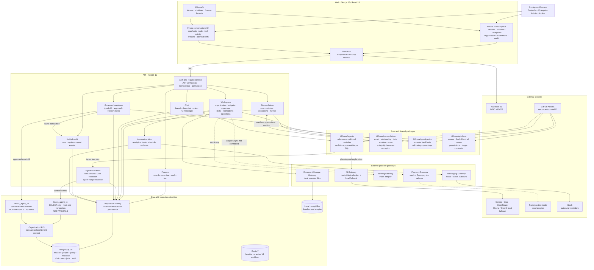
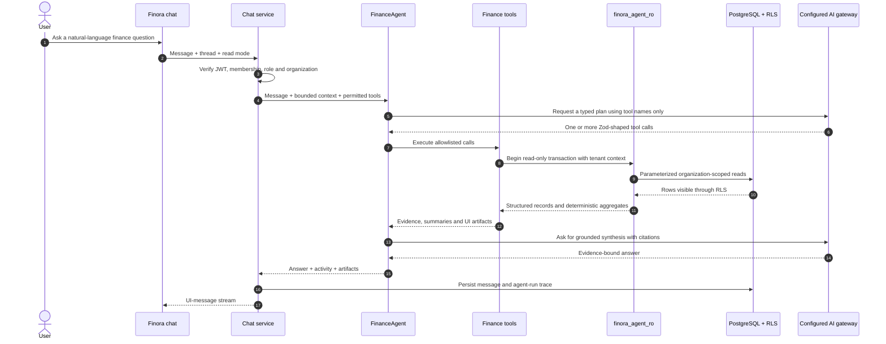
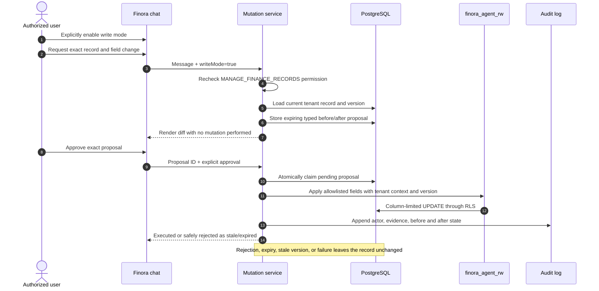
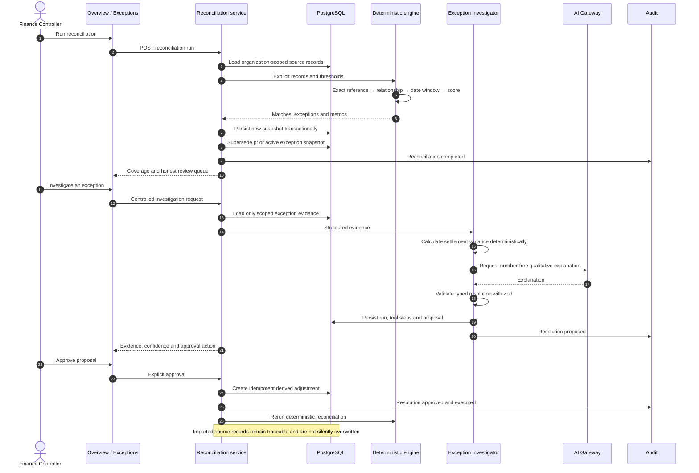
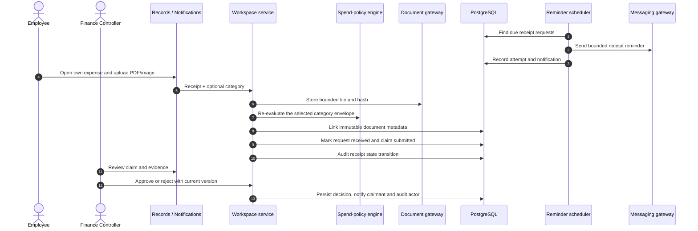
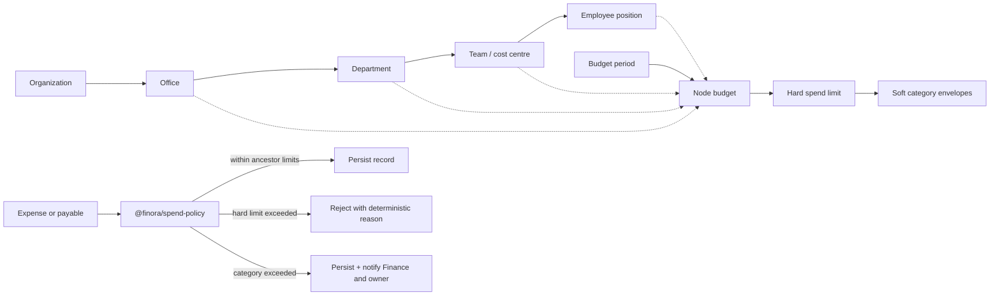
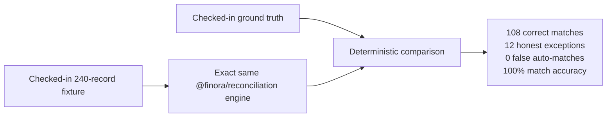
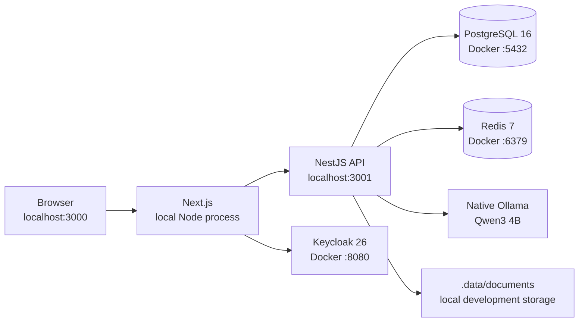

# FinoraOS system design

> Architecture reference for the implemented V1 as of 2 September 2026. Solid lines are working paths. Dashed lines are adapters or capabilities that are not end-to-end.


## 1. System intent

FinoraOS is an **AI-native finance operations OS**: a governed control plane connecting financial records, employees, organization structure, receipts, budgets, reconciliation, agents, approvals, notifications, integrations, and audit.

It is not intended to replace a general ledger or ERP in V1. It sits across finance sources and closes operational loops while retaining evidence and human control.

The flagship loop is:

```text
multi-source records
  → deterministic reconciliation
  → honest exceptions
  → scoped AI investigation
  → typed proposal
  → human approval
  → controlled execution
  → audit and reconciliation rerun
```

The governing principle is: **deterministic software verifies; AI interprets ambiguity; policy controls action.**

## 2. Actors and access boundaries

| Actor              | Product scope                                                                                          | Agent scope                                                             |
| ------------------ | ------------------------------------------------------------------------------------------------------ | ----------------------------------------------------------------------- |
| Employee           | Own expense claims, receipt evidence, reimbursement state, and notifications                           | Own-profile and own-expense read tools only                             |
| Finance Controller | Organization finance records, reconciliation, exceptions, expense review, and Finora                   | Organization finance tools, investigation, and approval-gated proposals |
| Enterprise Admin   | Organization hierarchy, budgets, spend controls, skills, integrations, policies, operations, and audit | Administrative read tools and permitted governed actions                |
| Auditor            | Tenant audit and permitted finance evidence                                                            | Read-only audit tools; no investigation or writes                       |
| System jobs        | Receipt reminders and recorded automation runs                                                         | No free-form model authority                                            |

Keycloak authenticates the person, but the database membership is authoritative for the workspace role. NestJS resolves `subject + organization_id` to that membership on every request. UI visibility is a usability boundary; API permissions and database tenancy remain the security boundaries.

## 3. Container and component architecture



## 4. Domain ownership

| Boundary         | Owns                                                                                                                            | Does not own                                  |
| ---------------- | ------------------------------------------------------------------------------------------------------------------------------- | --------------------------------------------- |
| Finance          | Payments, settlements, invoices, tax lines, cash movements, forecasts, record projections                                       | Agent planning or vendor SDKs                 |
| Reconciliation   | Runs, deterministic matches, active exception snapshots, evidence, measured metrics                                             | LLM decisions                                 |
| Workspace        | Organization nodes, budgets, spend limits, expense claims, receipts, skills, notifications, jobs, policies, connection metadata | Raw provider integrations                     |
| Chat             | Threads, messages, bounded conversation context, UI-message responses                                                           | Unrestricted database access                  |
| Agents and tools | Permission-filtered tool catalogue, execution, investigations, agent runs and steps                                             | Prisma inside agent packages                  |
| Mutations        | Typed proposals, expiry, approval/rejection, optimistic execution                                                               | Arbitrary SQL, deletes, or unapproved changes |
| Audit            | Tenant-scoped history across user, agent, automation, and finance actions                                                       | Business-state authority                      |
| Gateways         | AI, payment, banking, messaging, and document provider boundaries                                                               | Finance business rules                        |

## 5. Controlled read path

Finora is read-only by default. The controller can plan a bounded multi-tool query, but it cannot construct SQL or receive database credentials.



Safety properties:

- Allowed tools are derived from the database-owned role before planning and checked again before execution.
- `finora_agent_ro` has `SELECT` only, read-only transactions, no inherited privileges, and `NOBYPASSRLS`.
- Missing or invalid organization context returns no rows.
- Decimal calculations and record filtering happen in deterministic TypeScript/SQL, not in prompts.
- The answer is checked against observations; structured tables and metrics originate from tools.

## 6. Governed write path

Chat write mode does not grant the model write access. It only makes the proposal tool available to an authorized role.



The writer cannot modify external IDs or organization ownership and has no `DELETE`, `TRUNCATE`, arbitrary `INSERT`, schema, or sequence privileges. Write mode is deliberately non-persistent.

## 7. Reconciliation and exception-closure path



## 8. Employee receipt and expense-review path



Hard spend limits reject a prohibited new spend. Soft category limits preserve the record and create deduplicated notifications for Finance and the relevant node owner. Receipt evidence is stored separately from the imported financial record.

## 9. Organization and policy model



Organization nodes are generic so an enterprise can model offices, departments, teams, cost centres, or employee positions without introducing a table for every hierarchy type. A child allocation cannot exceed its parent envelope.

## 10. Persistence and traceability

PostgreSQL is the source of truth for:

- organizations, users, memberships, and hierarchy nodes;
- budgets, spend limits, and category envelopes;
- transactions, settlements, invoices, tax lines, cash accounts and movements;
- expense claims, receipt requests, and immutable document metadata;
- reconciliation runs, matches, exceptions, evidence, proposals, and adjustments;
- chat threads/messages, agent runs/steps, and custom skill versions;
- notifications, integration metadata, policies, automation jobs/runs, and audit events.

Money uses `Decimal(18,2)` in PostgreSQL, decimal strings at API boundaries, and `decimal.js` in TypeScript. Currency is explicit on monetary records. Raw imports retain source metadata; corrections create traceable state transitions instead of erasing provenance.

## 11. Evaluation and reproducibility



The API and `pnpm eval:reconciliation` import the same pure engine. The evaluation does not call Ollama, a hosted model, Prisma, or a live integration. This prevents the demo metric from drifting away from the application algorithm.

CI runs frozen dependency installation, enum synchronization, formatting, lint, typechecking, unit tests, and a production build in one resource-bounded job. AI tests use `MockAiGateway`.

## 12. Runtime and failure behavior

| Failure                                         | System behavior                                                                             |
| ----------------------------------------------- | ------------------------------------------------------------------------------------------- |
| Hosted AI provider unavailable                  | Gateway falls back to local Ollama when configured                                          |
| All AI unavailable                              | Deterministic finance features remain available; AI path returns a clear failure            |
| Invalid model tool plan                         | Zod validation, retry with schema feedback, then conservative deterministic routing/failure |
| Unauthorized tool selection                     | Execution layer rejects it even if the model requested it                                   |
| Missing tenant context                          | Agent database identities return zero rows through RLS                                      |
| Duplicate or ambiguous reconciliation candidate | Record remains an exception; no unsafe auto-match                                           |
| Duplicate reconciliation run                    | Prior active exception snapshot is superseded, not duplicated                               |
| Stale mutation proposal                         | Optimistic version check rejects it without changing data                                   |
| Expired/rejected proposal                       | No writer execution occurs                                                                  |
| Receipt category overage                        | Record remains visible; targeted warning is emitted                                         |
| Hard spend-limit breach                         | Record/import row is rejected with a deterministic reason                                   |
| Reminder delivery failure                       | Automation run records the outcome for Operations review                                    |

Development logs are compact and colored; production logs are structured JSON. Logs include request, organization, reconciliation, exception, and agent-run identifiers where relevant, while redacting credentials, authorization headers, secrets, and prompt/record bodies.

## 13. Development deployment topology



`pnpm dev` performs port preflight, starts PostgreSQL, Redis, and Keycloak, waits for health, deploys migrations, provisions and verifies both agent database roles, refreshes the deterministic seed, and starts web/API processes. On termination it shuts down child processes and the development containers.

## 14. Implemented versus integration-ready

| Area                                                                                   | V1 status                                                                                          |
| -------------------------------------------------------------------------------------- | -------------------------------------------------------------------------------------------------- |
| Reconciliation engine, transactional persistence, metrics and evaluation               | Implemented and tested                                                                             |
| Exception investigation, typed proposal, approval, derived adjustment, audit and rerun | Implemented; no real-money movement                                                                |
| Role-aware multi-tool chat                                                             | Implemented with controlled tools and persisted threads                                            |
| Agent read mode                                                                        | Implemented with `finora_agent_ro` and organization RLS                                            |
| Agent write mode                                                                       | Implemented as approval-gated, allowlisted field updates through `finora_agent_rw`                 |
| Keycloak login and database-owned RBAC                                                 | Implemented for development                                                                        |
| Employee receipt upload and finance review                                             | Implemented with a local document adapter                                                          |
| Organization hierarchy, budgets and spend controls                                     | Implemented with deterministic policy checks                                                       |
| Custom skills, notifications, jobs, operations and unified audit                       | Implemented                                                                                        |
| Razorpay                                                                               | Test-mode read adapter exists; synchronization, cursors and webhooks are not connected             |
| Banking / ERP                                                                          | Explicitly mocked or disconnected                                                                  |
| Slack                                                                                  | Outbound reminders implemented; inbound receipt capture is not implemented                         |
| Receipt processing                                                                     | Upload and evidence workflow implemented; OCR, malware scanning and object storage are future work |
| Redis                                                                                  | Healthy development service; no active V1 application workload                                     |
| Autonomous closure                                                                     | Disabled; sensitive proposals require a human                                                      |

## 15. Core guarantees

- The model never receives SQL, database credentials, raw write authority, or permission to invent amounts.
- The authenticated identity, database membership, permission checks, and organization RLS determine access—not prompt text.
- Every sensitive chat change is a typed, expiring diff requiring explicit approval.
- Exact finance arithmetic, matching, limits, status validation, and version checks are deterministic.
- Imported source records and receipt evidence remain traceable.
- Every material user, agent, automation, approval, and mutation event is tenant-scoped and auditable.
- Difficult records remain visible as exceptions instead of being hidden to improve metrics.
